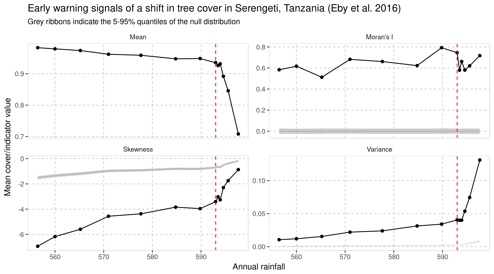

[](https://travis-ci.org/spatial-ews/spatialwarnings) 
[](https://codecov.io/github/spatial-ews/spatialwarnings?branch=master) 
[](https://cran.r-project.org/package=spatialwarnings) 

Spatial early warning signs - R package
=======================================

The package provided here helps computing spatial early warning signals of
critical transitions. This is part of a collaborative project between [Sonia
Kefi's group](http://sonia.kefi.fr/) (Institut de Sciences d'Evolution, CNRS,
IRD, Université Montpellier, France) and [Vishwesha
Guttal's](https://teelabiisc.wordpress.com/) (Center for Ecological Sciences,
Indian Institute of Science, Bangalore, India).

The R package provides several sets of functions related to the computation of
early warning signals of ecosystem tipping points and irreversible
transitions (also known as *catastrophic shifts*). In particular, it
facilitates computing those indicators, assess their significance and plot
their trends.

## Contributors

Alain Danet, [Alex Genin (Maintainer)](mailto:alexandre.genin@umontpellier.fr),
Vishwesha Guttal, Sonia Kefi, Sabiha Majumder, Sumithra Sankaran, [Florian Schneider](mailto:florian.schneider@univ-montp2.fr)

## Installation

`spatialwarnings` is available on CRAN and can be installed through:

```r
install.packages('spatialwarnings')
```

The developement version of this package can be installed using the
`devtools` package in R:

```
if ( ! require(devtools) ) {
  install.packages("devtools")
}
devtools::install_github("spatial-ews/spatialwarnings")
```

## The spatial indicators

Ecological systems can suffer drastic transitions such as desertification or
eutrophication, sometimes even after a slight change in one or more external
parameters, such as aridity or nutrient input. These qualitative changes in the
behavior of a system at a threshold represents a critical or bifurcation point,
and can give rise to *catastrophic shifts* when associated with irreversibility.
A growing body of litterature suggests that a dynamical system should exhibit
certain measurable properties around those critical points.

This package aims at providing a practical set of tools for the detection of
these upcoming critical points in spatial datasets, by using indicators based on
those properties. Those indicators fall within broad families around which the
package is centered:

  * "Generic" spatial indicators
  * Spectrum-based indicators
  * Indicators based on patch-size distributions

Each of these indicator types can be computed with this package. Their
significance can be assessed using permutation-based tests and results can
be displayed using familiar summary/plot methods.

## Code sample

```r
> library(ggplot2)
> library(spatialwarnings)
>
> # Compute indicators
> serengeti.ic <- generic_spews(serengeti,
>                               subsize = 5,
>                               moranI_coarse_grain = TRUE)
> serengeti.test <- indictest(serengeti.ic)

```

```r
> # Textual summary of trends
> summary(serengeti.test)
Generic Spatial Early-Warnings

 Mat. # Mean Moran's I P>null     Skewness P>null     Variance P>null
      1 0.98      0.58 <1e-03 ***    -6.94  0.999        0.011 <1e-03 ***
      2 0.98      0.62 <1e-03 ***    -6.17  0.999        0.012 <1e-03 ***
      3 0.97      0.51 <1e-03 ***    -5.59  0.999        0.015 <1e-03 ***
      4 0.96      0.68 <1e-03 ***    -4.56  0.999        0.022 <1e-03 ***
      5 0.96      0.66 <1e-03 ***    -4.37  0.999        0.024 <1e-03 ***
      6 0.95      0.62 <1e-03 ***    -3.84  0.999        0.031 <1e-03 ***
      7 0.95      0.79 <1e-03 ***    -3.96  0.999        0.034 <1e-03 ***
      8 0.94      0.75 <1e-03 ***    -3.40  0.999        0.041 <1e-03 ***
      9 0.93      0.66 <1e-03 ***    -3.26  0.999        0.040 <1e-03 ***
     10 0.93      0.58 <1e-03 ***    -3.02  0.999        0.040 <1e-03 ***
     11 0.89      0.58 <1e-03 ***    -2.29  0.999        0.054 <1e-03 ***
     12 0.85      0.62 <1e-03 ***    -1.75  0.999        0.074 <1e-03 ***
     13 0.71      0.72 <1e-03 ***    -0.87  0.999        0.131 <1e-03 ***

 Significance tested against 999 randomly shuffled matrices
 Signif. codes:  0 '***' 0.001 '**' 0.01 '*' 0.05 '.' 0.1 ' ' 1

```

```r
> # Plot trends
> plot(serengeti.test, along = serengeti.rain) +
>  geom_vline(xintercept = 593, color = "red", linetype = "dashed") +
>  labs(x = "Annual rainfall",
>       y = "Mean cover/indicator value",
>       title = "Early warning signals of a shift in tree cover in Serengeti, Tanzania (Eby et al. 2016)",
>       subtitle = "Grey ribbons indicate the 5-95% quantiles of the null distribution")
```



## Original authors and License

This package is derived from the [Dakos et al.'s work](https://github.com/earlywarningtoolbox/spatial_warnings) on early warnings signals (see also the
reference website for the [early-warnings signals toolbox](http://www.early-warning-signals.org/)).

### License

This work is licensed under an MIT license. Some code included in unit tests has
been written by Cosma Rohilla Shalizi [http://bactra.org/](http://bactra.org/)
and is redistributed in its entirety with the R package as specified in its
README file.

The MIT License (MIT)

Copyright (c) 2015 the authors

Permission is hereby granted, free of charge, to any person obtaining a copy
of this software and associated documentation files (the "Software"), to deal
in the Software without restriction, including without limitation the rights
to use, copy, modify, merge, publish, distribute, sublicense, and/or sell
copies of the Software, and to permit persons to whom the Software is
furnished to do so, subject to the following conditions:

The above copyright notice and this permission notice shall be included in
all copies or substantial portions of the Software.

THE SOFTWARE IS PROVIDED "AS IS", WITHOUT WARRANTY OF ANY KIND, EXPRESS OR
IMPLIED, INCLUDING BUT NOT LIMITED TO THE WARRANTIES OF MERCHANTABILITY,
FITNESS FOR A PARTICULAR PURPOSE AND NONINFRINGEMENT. IN NO EVENT SHALL THE
AUTHORS OR COPYRIGHT HOLDERS BE LIABLE FOR ANY CLAIM, DAMAGES OR OTHER
LIABILITY, WHETHER IN AN ACTION OF CONTRACT, TORT OR OTHERWISE, ARISING FROM,
OUT OF OR IN CONNECTION WITH THE SOFTWARE OR THE USE OR OTHER DEALINGS IN
THE SOFTWARE.

## References

[Kéfi S, Guttal V, Brock WA, Carpenter SR, Ellison AM, et al. (2014)
Early Warning Signals of Ecological Transitions: Methods for Spatial Patterns.
PLoS ONE 9(3): e92097. doi:10.1371/journal.pone.0092097](http://journals.plos.org/plosone/article?id=10.1371/journal.pone.0092097)

