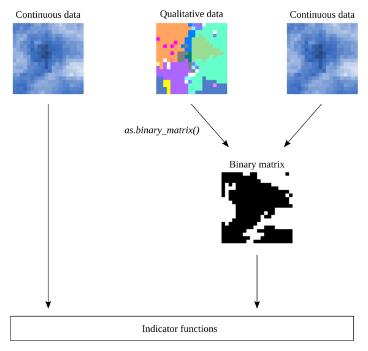

Ecosystems can undergo rapid and discontinuous transitions, even after a small 
change in their control parameters. Arid systems can go extinct, lakes can 
become eutrophized and forest patches can fail to maintain themselves, even 
after a small increase in the external pressure they bear. Those sharp 
transitions after a threshold has been crossed are gathered under the umbrella 
term of *critical transitions*. Some of them can even show irreversibility, 
where returning the external conditions to their original values is 
insufficient to restore the ecosystem to its original state. The latter type of
transition is a *catastrophic shift*. 

A body of theoretical work suggests that ecosystems should show some 
deviation in their characteristics before undergoing such a transition, hence 
the development of *indicators* or *early-warning signals* of critical 
transitions. These indicators are developed for time-series (package 
[earlywarnings](https://cran.r-project.org/web/packages/earlywarnings/)) 
and spatial data (this package). 

The *spatialwarnings* package provides user-friendly tools to compute, test for
significance and plot the indicators. This document provides an overview of the 
package and a possible workflow. 

The package provides many indicators, most of which falling into three broad 
categories, that are detailed thereafter with their corresponding package 
function: 

- "Generic" early-warning signals (`generic_spews`)
- Spectral indicators (`spectral_spews`)
- Patch-based indicators (`patch_spews`)
- Potential-analysis (`potential_analysis`)

This vignette will go through the suggested workflow for all these indicators
using an example dataset: the output from Kubo et al's (1996) forest gap model.

# Preparing your data 

The package assumes on raster-like data, *i.e.* values regularly-spaced point 
along a 2D grid. Some indicators assume continuous data, however, some 
others require binary (1/0) data. Some conversion may thus be required before 
computing the indicators.

A conversion generic function `as.binary_matrix` is provided and will handle the 
conversion of discrete data to binary matrices for standard `matrix` objects, 
data frames or list of those (see Fig. 1). However, it is up to the user to 
convert quantitative data into a binary matrix if necessary (e.g. aerial 
imagery). 



Figure 1. Workflow for data preparation. 

<!-- we could add a conversion from raster -->

# *Generic* spatial early-warning signals

The rationale behind those indicators is a decrease in the return rates of a 
system (*Critical Slowing Down*, Scheffer et al., 2009) and the assymetry of the 
underlying potential near a critical point (Guttal et al., 2009).

These indicators can be applied both on continuous data and binary data 
(`binary matrix`). If the user supplies the latter, then an intermediate 
matrix is computed by coarse-graining (binning) the binary data into larger 
cells. 

```{r}
  library(spatialwarnings)
  library(ggplot2)
  
  # Load and make data available
  attach(forestdat) # make variable matrices and parameters available
  
  # Compute generic early warning signals
  test.dat <- generic_spews(matrices)
  test.summary <- summary(test.dat)
  
  # Plot along the replicate number
  plot(test.summary, along = parameters[ ,"delta"]) + xlab('delta')
```

# Using single indicator functions 

All indicators can be computed using the `indicator_*` function family. Those
functions all accept quantitative or binary data matrices, or lists of two. 

For example, using the `forestdat` example dataset, we can compute the moran 
indicator : 
  
```{r}
moran.example <- with(forestdat, indicator_moran(matrices))

str(moran.example)
```

Here is an exhaustive list (27-11-2015) of the indicator functions: 
  
- indicator_corrfunc
- indicator_fitpsd
- indicator_largestpatch
- indicator_powerspectrum
- indicator_variance
- indicator_cumpsd
- indicator_fracgeo
- indicator_moran
- indicator_skewness

# References

Guttal, V., & Jayaprakash, C. (2009). Spatial variance and spatial skewness: Leading indicators of regime shifts in spatial ecological systems. Theoretical Ecology, 2(1), 3–12. http://doi.org/10.1007/s12080-008-0033-1

Kubo, T., Iwasa, Y., & Furumoto, N. (1996). Forest spatial dynamics with gap
expansion: Total gap area and gap size distribution. Journal of Theoretical
Biology, 180(3), 229–246. http://doi.org/10.1006/jtbi.1996.0099

Scheffer, M., Bascompte, J., Brock, W. a, Brovkin, V., Carpenter, S. R., Dakos, V., … Sugihara, G. (2009). Early-warning signals for critical transitions. Nature, 461(7260), 53–9. http://doi.org/10.1038/nature08227
